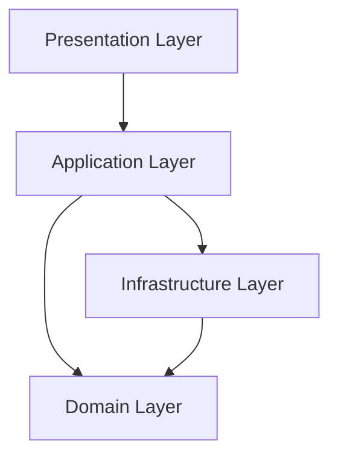
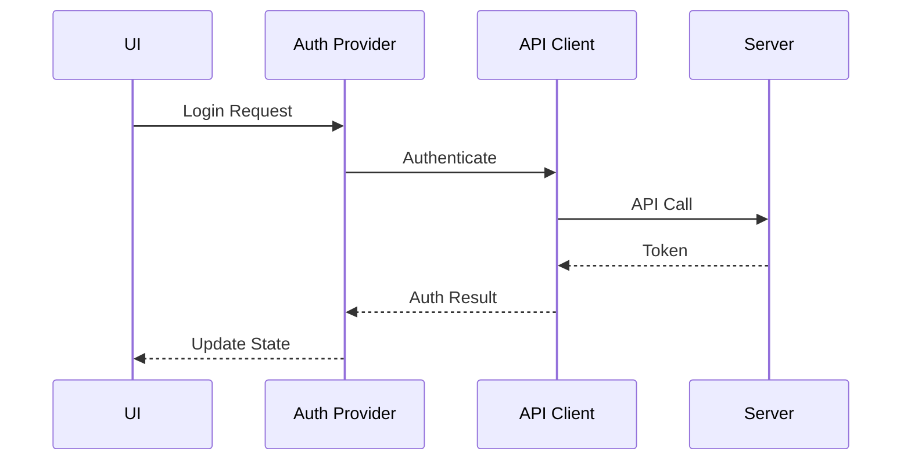
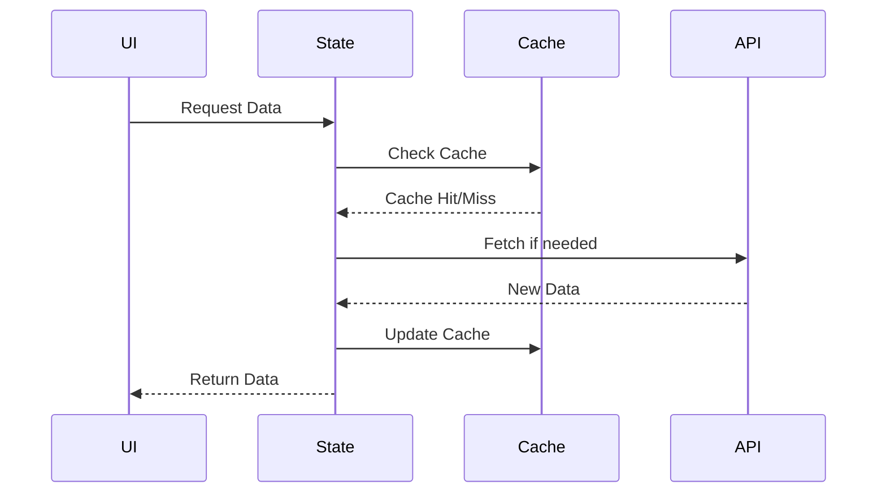

# システムパターン

## アーキテクチャ
プロジェクトはクリーンアーキテクチャの原則に従って構築されています：



### レイヤー構成
1. **Presentation Layer** (`lib/presentation/`)
   - UI components
   - Screens
   - Widgets
   - Theme definitions

2. **Application Layer** (`lib/application/`)
   - State management
   - Use cases
   - Configuration

3. **Domain Layer** (`lib/domain/`)
   - Business logic
   - Entity definitions
   - Feature interfaces

4. **Infrastructure Layer** (`lib/infrastructure/`)
   - External services implementation
   - Database access
   - API clients

## デザインパターン

### UIコンポーネント設計
- タイムライン表示パターン
  ```mermaid
  graph TD
    TimelineView[TimelineView]
    TimeGrid[TimeGrid]
    EventLayer[EventLayer]
    TimeIndicator[TimeIndicator]
    EventCard[EventCard]
    
    TimelineView --> TimeGrid
    TimelineView --> EventLayer
    TimelineView --> TimeIndicator
    EventLayer --> EventCard
    
    style TimelineView fill:#f9f,stroke:#333
    style EventLayer fill:#bbf,stroke:#333
  ```

  1. コンポーネント構造
     - TimelineViewコンテナ
       - 時間軸の管理
       - スクロール制御
       - ズーム制御
     - TimeGridレイヤー
       - 時間グリッドの描画
       - 時間ラベルの表示
     - EventLayerコンポーネント
       - イベントの配置管理
       - 重複の解決
       - レイアウト最適化
     - TimeIndicator
       - 現在時刻の表示
       - 時間の進行表現

  2. イベント処理フロー
  ```mermaid
  sequenceDiagram
    participant TV as TimelineView
    participant EL as EventLayer
    participant EC as EventCard
    
    TV->>EL: イベントデータ
    EL->>EL: 位置計算
    EL->>EL: 重複チェック
    EL->>EC: レイアウト情報
    EC->>EC: レンダリング
    EC-->>TV: インタラクション
  ```

  3. レイアウトアルゴリズム
     - 時間位置の計算
     - 重複イベントの配置
     - 表示領域の最適化

### 状態管理
- Providerパターンを使用
- 各機能ごとに専用のProvider
- 状態の分離と再利用性の確保

### データアクセス
- Repository パターン
- 外部APIアクセスの抽象化
- ローカルキャッシュ戦略

### 依存性注入
- Provider based DI
- テスト容易性の確保
- 疎結合なコンポーネント設計

## コンポーネント関係

### 認証フロー


### データ同期


## エラー処理
- 階層的なエラーハンドリング
- ユーザーフレンドリーなエラーメッセージ
- リトライメカニズム

## キャッシュ戦略
- オフライン優先アプローチ
- バックグラウンド同期
- データの有効期限管理

## セキュリティ
- トークンベースの認証
- セキュアなデータストレージ
- 通信の暗号化
